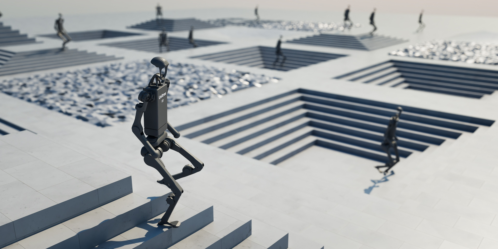

---


[![IsaacSim](https:
[![Python](https:
[![Linux platform](https:
[![Windows platform](https:
[![pre-commit](https:
[![docs status](https:
[![License](https:
[![License](https:


**Isaac Lab** is a GPU-accelerated, open-source framework designed to unify and simplify robotics research workflows,
such as reinforcement learning, imitation learning, and motion planning. Built on [NVIDIA Isaac Sim](https:
it combines fast and accurate physics and sensor simulation, making it an ideal choice for sim-to-real
transfer in robotics.

Isaac Lab provides developers with a range of essential features for accurate sensor simulation, such as RTX-based
cameras, LIDAR, or contact sensors. The framework's GPU acceleration enables users to run complex simulations and
computations faster, which is key for iterative processes like reinforcement learning and data-intensive tasks.
Moreover, Isaac Lab can run locally or be distributed across the cloud, offering flexibility for large-scale deployments.


Isaac Lab offers a comprehensive set of tools and environments designed to facilitate robot learning:

- **Robots**: A diverse collection of robots, from manipulators, quadrupeds, to humanoids, with 16 commonly available models.
- **Environments**: Ready-to-train implementations of more than 30 environments, which can be trained with popular reinforcement learning frameworks such as RSL RL, SKRL, RL Games, or Stable Baselines. We also support multi-agent reinforcement learning.
- **Physics**: Rigid bodies, articulated systems, deformable objects
- **Sensors**: RGB/depth/segmentation cameras, camera annotations, IMU, contact sensors, ray casters.


Our [documentation page](https:
detailed tutorials and step-by-step guides. Follow these links to learn more about:

- [Installation steps](https:
- [Reinforcement learning](https:
- [Tutorials](https:
- [Available environments](https:


Isaac Lab is built on top of Isaac Sim and requires specific versions of Isaac Sim that are compatible with each
release of Isaac Lab. Below, we outline the recent Isaac Lab releases and GitHub branches and their corresponding
dependency versions for Isaac Sim.

| Isaac Lab Version             | Isaac Sim Version         |
| ----------------------------- | ------------------------- |
| `main` branch                 | Isaac Sim 4.5 / 5.0       |
| `v2.3.X`                      | Isaac Sim 4.5 / 5.0 / 5.1 |
| `v2.2.X`                      | Isaac Sim 4.5 / 5.0       |
| `v2.1.X`                      | Isaac Sim 4.5             |
| `v2.0.X`                      | Isaac Sim 4.5             |


We wholeheartedly welcome contributions from the community to make this framework mature and useful for everyone.
These may happen as bug reports, feature requests, or code contributions. For details, please check our
[contribution guidelines](https:


We encourage you to utilize our [Show & Tell](https:
area in the `Discussions` section of this repository. This space is designed for you to:

* Share the tutorials you've created
* Showcase your learning content
* Present exciting projects you've developed

By sharing your work, you'll inspire others and contribute to the collective knowledge
of our community. Your contributions can spark new ideas and collaborations, fostering
innovation in robotics and simulation.


Please see the [troubleshooting](https:
common fixes or [submit an issue](https:

For issues related to Isaac Sim, we recommend checking its [documentation](https:
or opening a question on its [forums](https:


* Please use GitHub [Discussions](https:
  asking questions, and requests for new features.
* Github [Issues](https:
  work with a definite scope and a clear deliverable. These can be fixing bugs, documentation issues, new features,
  or general updates.


Do you have a project or resource you'd like to share more widely? We'd love to hear from you!
Reach out to the NVIDIA Omniverse Community team at OmniverseCommunity@nvidia.com to explore opportunities
to spotlight your work.

You can also join the conversation on the [Omniverse Discord](https:
connect with other developers, share your projects, and help grow a vibrant, collaborative ecosystem
where creativity and technology intersect. Your contributions can make a meaningful impact on the Isaac Lab
community and beyond!


The Isaac Lab framework is released under [BSD-3 License](LICENSE). The `isaaclab_mimic` extension and its
corresponding standalone scripts are released under [Apache 2.0](LICENSE-mimic). The license files of its
dependencies and assets are present in the [`docs/licenses`](docs/licenses) directory.

Note that Isaac Lab requires Isaac Sim, which includes components under proprietary licensing terms. Please see the [Isaac Sim license](docs/licenses/dependencies/isaacsim-license.txt) for information on Isaac Sim licensing.

Note that the `isaaclab_mimic` extension requires cuRobo, which has proprietary licensing terms that can be found in [`docs/licenses/dependencies/cuRobo-license.txt`](docs/licenses/dependencies/cuRobo-license.txt).


Isaac Lab development initiated from the [Orbit](https:
you would cite it in academic publications as well:

```
@article{mittal2023orbit,
   author={Mittal, Mayank and Yu, Calvin and Yu, Qinxi and Liu, Jingzhou and Rudin, Nikita and Hoeller, David and Yuan, Jia Lin and Singh, Ritvik and Guo, Yunrong and Mazhar, Hammad and Mandlekar, Ajay and Babich, Buck and State, Gavriel and Hutter, Marco and Garg, Animesh},
   journal={IEEE Robotics and Automation Letters},
   title={Orbit: A Unified Simulation Framework for Interactive Robot Learning Environments},
   year={2023},
   volume={8},
   number={6},
   pages={3740-3747},
   doi={10.1109/LRA.2023.3270034}
}
```
