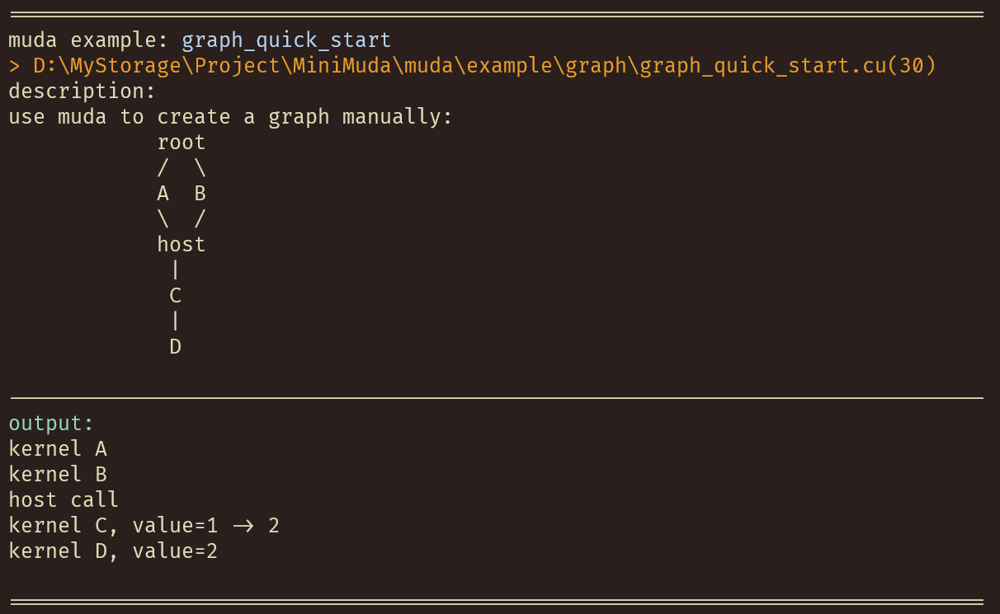
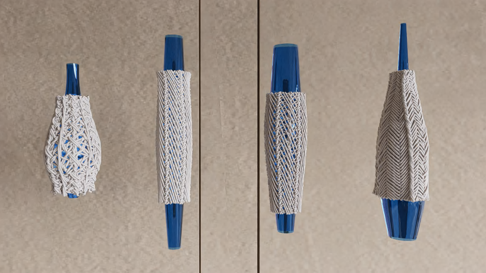
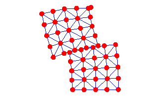

[TOC]


MUDA is **μ-CUDA**, yet another painless CUDA programming **paradigm**.

> COVER THE LAST MILE OF CUDA


**Detailed Introduction And Overview [Highly Recommended]**  :arrow_right: https:

**Project Templates** :arrow_right: https:

```c++


using namespace muda;

int main()
{
    constexpr int N = 8;


    DeviceBuffer<int> buffer;
    buffer.resize(N);
    buffer.fill(1);


    Logger logger;


    ParallelFor()
        .kernel_name("hello_muda")
        .apply(N,
      	[
            buffer = buffer.viewer().name("buffer"),
            logger = logger.viewer()
        ] __device__(int i)
        {
            logger << "buffer(" << i << ")=" << buffer(i) << "\n";
        });

    logger.retrieve(std::cout);
}
```


```shell
$ mkdir CMakeBuild
$ cd CMakeBuild
$ cmake -S ..
$ cmake --build .
```


Run example:

```shell
$ xmake f --example=true
$ xmake
$ xmake run muda_example hello_muda
```
To show all examples:

```shell
$ xmake run muda_example -l
```
Play all examples:

```shell
$ xmake run muda_example
```


Because **muda** is header-only, copy the `src/muda/` folder to your project, set the include directory, and everything is done.


| Macro                     | Value               | Details                                                      |
| ------------------------- | ------------------- | ------------------------------------------------------------ |
| `MUDA_CHECK_ON`           | `1`(default) or `0` | `MUDA_CHECK_ON=1` for turn on all muda runtime check(for safety) |
| `MUDA_WITH_COMPUTE_GRAPH` | `1`or`0`(default)   | `MUDA_WITH_COMPUTE_GRAPH=1` for turn on muda compute graph feature |

If you manually copy the header files, don't forget to define the macros yourself. If you use cmake or xmake, just set the project dependency to muda.


- [tutorial_zh](https:
- [tutorial_en](https:


Documentation is maintained on https:


Download and install doxygen https:

Install [mkdocs](https:

```shell
pip install mkdocs mkdocs-material mkdocs-literate-nav mkdoxy
```

Turn on the local server:

```shell
mkdocs serve
```

If you are writing the document, you can use the following command to avoid generating the API documentation all the time:

```shell
mkdocs serve -f mkdocs-no-api.yaml
```

Open the browser and visit the [localhost:8000](http:

To update the document on the website, run:

```shell
cd muda/scripts
python build_docs.py -o <path of your local muda-doc repo>
```

If you put the local muda-doc repo in the same directory as muda like:
```
- PARENT_FOLDER
  - muda
  - muda-doc
```

Then the following instruction is enough:
```shell
cd muda/scripts
python build_docs.py
```


- [examples](./example/)

All examples in `muda/example` are self-explanatory,  enjoy it.




Contributions are welcome. We are looking for or are working on:

1. **muda** development

2. fancy simulation demos using **muda**

3. better documentation of **muda**


- [Libuipc](https:

  ```
  @article{10.1145/3735126,
  author = {Huang, Kemeng and Lu, Xinyu and Lin, Huancheng and Komura, Taku and Li, Minchen},
  title = {StiffGIPC: Advancing GPU IPC for Stiff Affine-Deformable Simulation},
  year = {2025},
  publisher = {Association for Computing Machinery},
  volume = {44},
  number = {3},
  issn = {0730-0301},
  doi = {10.1145/3735126},
  journal = {ACM Trans. Graph.},
  month = may,
  articleno = {31},
  numpages = {20}
  }
  ```
  

- Topological braiding simulation using **muda** (old version)

  ```latex
  @article{article,
  author = {Lu, Xinyu and Bo, Pengbo and Wang, Linqin},
  year = {2023},
  month = {07},
  pages = {},
  title = {Real-Time 3D Topological Braiding Simulation with Penetration-Free Guarantee},
  volume = {164},
  journal = {Computer-Aided Design},
  doi = {10.1016/j.cad.2023.103594}
  }
  ```

  

- [solid-sim-muda](https:

  


