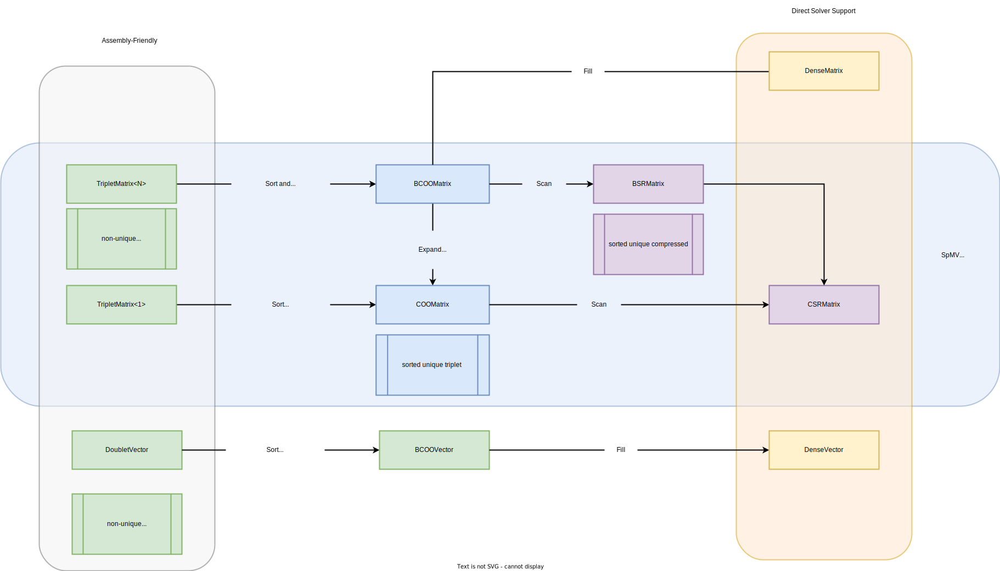
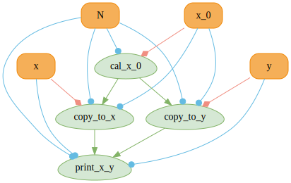
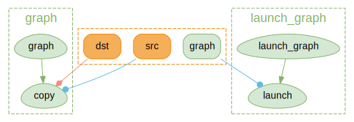

MUDA is **μ-CUDA**, yet another painless CUDA programming **paradigm**.

> COVER THE LAST MILE OF CUDA


- Header-only library right out of the box
- Depends only on CUDA and standard libraries
- Improve readability, maintainability, security, and debugging efficiency of CUDA code.
- Reduce the difficulty of building CUDA Graphs and increase automation.


Think that you wanna try a new idea or implement a demo with CUDA. If the demo works well, you want to embed it into your project quickly. But you find that using CUDA directly will be a catastrophic disaster.

Coding with C-API CUDA, you will be buried in irrelevant details, and the information density of the code is very low, which means that you need to write a lot of redundant code to achieve a simple function. Less is more, right?

Debugging the GPU code is a nightmare. How much time do you spend on those weird Error Codes from CUDA, and finally find it's an illegal memory access?


Using a GPU Debugger when something goes wrong may be an approach. But the best way is to prevent bugs from happening, right? Most of the time, automatic range checking is all we want. It's a pretty fantasy that someone tells you, "Hey Bro, at `Block 103, Thread 45`, in kernel named `set_up_array`, the buffer named `array` goes out of range because your index is `100` while the array size is `96`." After that, it exits the kernel and stops the program for you to prevent later chained dummy bugs from producing confusing debug information.

It is muda!

If you access memory resource using a MUDA **Viewer**. Dear muda will tell you all about that.

MUDA also provides an elegant way to create and update [CUDA Graph](https:

- Users almost take only a bit of effort to switch from the Stream-Base Launch Mode to Graph Launch Mode.
- Updating the node parameters and shared resources in CUDA Graphs becomes intuitive, safe, and efficient.

Simple to extend.

- User can obey the primary interface of muda to define their own object to reuse the MUDA facility
- Almost all "Resource View Type" can be used directly in the MUDA `ComputeGraph`.


**Nop!** MUDA is a supplement of thrust!

> [Thrust](https:

Using iterators to prevent range error is a high-level approach. However, we still need to access the memory manually in our own kernel, no matter whether using raw cuda kernel launch `<<<>>>` or using thrust agent kernel (most of the time, using a `thrust::counting_iterator` in a `thrust::for_each` algorithm).

So, I think MUDA is a mid-level approach. We have the same purpose but different levels and aim at different problems. Feel comfortable to use them together!

Here is an example for using Thrust and MUDA together.

```cpp
using namespace muda;
using namespace thrust;

constexpr auto N = 10;
DeviceVector<float> x(N);

KernelLabel label{"thrust"};


for_each(thrust::cuda::par_nosync,
         make_counting_iterator(0), make_counting_iterator(N),
         [x = x.viewer().name("x")] __device__(int i) mutable
         {
             x(i) = i;
         });
```


This is a quick overview of some muda APIs.

You can check it to find out something useful for you. A comprehensive description of MUDA is placed at [Tutorial](


Simple, self-explanatory, intellisense-friendly Launcher.

```cpp

using namespace muda;
__global__ void raw_kernel()
{
    printf("hello muda!\n");
}

int main()
{

    Launch(1, 1)
        .apply(
        [] __device__()
        {
            print("hello muda!\n");
        }).wait();

    constexpr int N = 8;

    ParallelFor(256 )
        .apply(N,
        [] __device__(int i)
        {
            print("hello muda %d!\n", i);
        }).wait();


    ParallelFor(8  ,
                32 )
        .apply(N,
        [] __device__(int i)
        {
            print("hello muda %d!\n", i);
        }).wait();


    ParallelFor().apply(N,
        [] __device__(int i)
        {
            print("hello muda %d!\n", i);
        }).wait();


    Kernel{32, 64,0, stream, other_kernel}(...)
}
```


A `std::cout` like output stream with overload formatting.

```cpp
Logger logger;
Launch(2, 2)
    .apply(
        [logger = logger.viewer()] __device__() mutable
        {

            logger << "int2: " << make_int2(1, 2) << "\n";
            logger << "float3: " << make_float3(1.0f, 2.0f, 3.0f) << "\n";
        })
    .wait();

logger.retrieve(std::cout);
```

You can define a global`__device__ LoggerViewer cout` and call the overloaded constructor `Logger(LoggerViewer* global_viewer)` to use it without any capturing, which is useful when you need to use logger in some function but don't want to put the `LoggerViewer` in the function parameter.

```cpp
namespace foo
{
__device__ LoggerViewer cout;
__device__ void say_hello() { cout << "hello global logger!\n"; }
}

int main()
{

    LoggerViewer* viewer_ptr = nullptr;
    checkCudaErrors(cudaGetSymbolAddress((void**)&viewer_ptr, foo::cout));
    Logger logger(viewer_ptr);

    Launch().apply([]__device__() mutable
        {
            foo::say_hello();
        })
    .wait();

    logger.retrieve(std::cout);
}
```

Further, you can use `muda::Debug::set_sync_callback()` to retrieve the output once `wait()` is called, as:

```cpp
__device__ LoggerViewer cout;

int main()
{

    LoggerViewer* viewer_ptr = nullptr;
    checkCudaErrors(cudaGetSymbolAddress((void**)&viewer_ptr, foo::cout));
    Logger logger(viewer_ptr);

    muda::Debug::set_sync_callback([&] { logger.retrieve(std::cout); });

    Launch().apply([]__device__() mutable
        {
            cout << "hello\n";
        })
    .wait();


}
```


A lightweight `std::vector`-like cuda device memory container.

In addition, 2D/3D aligned buffers are also provided.

```cpp
DeviceBuffer<int> buffer;


std::vector<int> host(8);
buffer.copy_from(host);


int host_array[8];
buffer.copy_to(host_array);


buffer.view(0,4).copy_from(host.data());

DeviceBuffer<int> dst_buffer{4};

buffer.view(0,4).copy_to(dst_buffer.view());


DeviceBuffer2D<int> buffer2d;
buffer2d.resize(Extent2D{5, 5}, 1);
buffer2d.resize(Extent2D{7, 2}, 2);
buffer2d.resize(Extent2D{2, 7}, 3);
buffer2d.resize(Extent2D{9, 9}, 4);

buffer2d.view(Offset2D{1,1}, Extent2D{3,3});
buffer2d.copy_to(host);

DeviceBuffer3D<int> buffer3d;
buffer3d.resize(Extent3D{3, 4, 5}, 1);
buffer3d.copy_to(host);
```

The old data will be safely kept if you resize a 2D or 3D buffer. If you don't want to keep the old data, use `.clear()` before your `.resize()`. The result of the above chain of 2D buffer resizing is shown below.


MUDA **Viewers** provide safe inner-kernel memory access, which checks all input to ensure access does not go out of range and does not dereference a null pointer. If something goes wrong, they report the debug information as much as possible and trap the kernel to prevent further errors.

You can fill out the `name` of a viewer and `kernel_name` or ``file_line` of a **Launcher** to get more readable debug information. These information only be removed in the release version.

```cpp
DeviceVar<int> single;
DeviceBuffer<int> array;
DeviceBuffer2D<int> array2d;
DeviceBuffer3D<int> array3d;
Logger logger;
Launch()
    .kernel_name(__FUNCTION__)
    .file_line(__FILE__, __LINE__)
    .apply(
    [
        single  = single.viewer().name("single"),
        array   = array.viewer().name("array"),
        array2d = array2d.viewer().name("array2d"),
        array3d = array3d.viewer().name("array3d"),
        logger  = logger.viewer(),
        ...
    ] __device__ () mutable
    {
        single = 1;
        array(i) = 1;
        array2d(offset_in_height, offset_in_width) = 1;
        array3d(offset_in_depth, offset_in_height, offset_in_width) = 1;
        logger << 1;
    });
```


If you don't want to launch something on the default stream, use `Stream` to create async streams. And you can use `Event` to synchronize between streams.

```cpp
Stream         s1, s2;
Event          set_value_done;

DeviceVar<int> v = 1;
on(s1)
    .next<Launch>(1, 1)
    .apply(
        [v = v.viewer()] __device__() mutable
        {
            int next = 2;
            v = next;
        })
    .record(set_value_done)
    .apply(
        [] __device__()
        {
            some_work();
        });

on(s2)
    .when(set_value_done)
    .next<Launch>(1, 1)
    .apply([v = v.viewer()] __device__()
           { int res = v; });
```


MUDA **Launchers**' functions are Asynchronous, meaning we need to call `.wait()` to synchronize it on the host, unlike some APIs such as `BufferView::copy_fom`. NOTE: Operations of a **Launcher** will be asynchronous as possible, so you should synchronize the stream by yourself, while other APIs will synchronize themselves.

```cpp

Kernel{..., f}(...);
Launch(stream).apply(...).wait();
ParallelFor(stream).apply(N, ...).wait();


GraphLaunch().launch(graph).wait();


Memory(stream).copy(...).wait();
Memory(stream).set(...).wait();


BufferLaunch(stream).copy(BufferView, ...).wait();
BufferLaunch(stream).fill(BufferView,...).wait();
```

Feel free to ignore `Memory` `BufferLaunch` **Launcher** when building your fast demo. Directly use the convenient synchronous APIs of `DeviceBuffer/BufferView` until you find it's the performance hotpot that will save you a lot of time.

It's a good practice to keep **Launchers** asynchronous while keeping other APIs synchronous, which obeys the 80/20 rule.


**MUDA** supports basic linear system operations. e.g.:

1. Sparse Matrix Format Conversion
2. Sparse Matrix Assembly
3. Linear System Solving



The only thing you need to do is to declare a `muda::LinearSystemContext`. Note: `LinearSystemContext` is a relative heavy resource, so you should keep and reuse it as much as possible.

```cpp
LinearSystemContext ctx;

DeviceTripletMatrix<float, 3> A_triplet;

A_triplet.reshape(block_rows,block_cols);

A_triplet.resize_triplets(hessian_count);


DeviceBCOOMatrix<float,3> A_bcoo;


DeviceBSRMatrix<float,3> A_bsr;


DeviceCSRMatrix<float,3> A_csr


DeviceDenseMatrix<float> A_dense;


ctx.convert(A_triplet, A_bcoo);
ctx.convert(A_bcoo, A_bsr);
ctx.convert(A_bsr, A_dense);
ctx.convert(A_bsr, A_csr);
ctx.convert(A_bcoo, A_dense);


```

We only allow users to assemble a Sparse Matrix from Triplet Matrix. And allow users to read from BCOOMatrix.

To assemble a Triplet Matrix, user need to use the `viewer` of a Triplet Matrix.

```cpp
DeviceTripletMatrix<float, 3> A_triplet;
A_triplet.resize(block_rows,block_cols,hessian_count);
DeviceDenseVector<float> x, b;
x.resize(block_rows * 3);
b.resize(block_rows * 3)

ParallelFor(256)
    .apply(hessian_count,
    [
        H = A_triplet.viewer().name("Hessian"),
        g = x.viewer().name("gradient")

    ] __device__(int i)
    {
        int row, col;
        Eigen::Matrix3f hessian;
        Eigen::Vector3f gradient;


        H(i).write(row,col, hessin);


        g.segment<3>(row * 3).atomic_add(gradient);
    }).wait();


ctx.convert(A_triplet, A_bcoo);
ctx.convert(A_bcoo, A_bsr);


ctx.spmv(A_bsr.cview(), x.cview(), b.view());
```

<!-- [TODO:] Later, we may involve [Expression Template](https:


MUDA now supports the `SoA/AoS/AoSoA` layouts. Users can switch between them seamlessly(with different builder parameters). The copy operation in all directions and layouts is well-supported.

Most of the time, `AoSoA` is the best layout for Vector and Matrix, with better [memory coalescing](https:

Here is a simple example of `muda::Field`.

```cpp


void field_example(FieldEntryLayout layout)
{
    using namespace muda;
    using namespace Eigen;

    Field field;


    auto& particle = field["particle"];
    float dt       = 0.01f;


    auto builder = particle.builder(FieldEntryLayout::AoSoA);
    auto& m      = builder.entry("mass").scalar<float>();
    auto& pos    = builder.entry("position").vector3<float>();
    auto& pos_old = builder.entry("position_old").vector3<float>();
    auto& vel     = builder.entry("velocity").vector3<float>();
    auto& force   = builder.entry("force").vector3<float>();

    auto& I = builder.entry("inertia").matrix3x3<float>();
    builder.build();


    constexpr int N = 10;
    particle.resize(N);

    Logger logger;

    ParallelFor(256)
        .kernel_name("setup_vars")
        .apply(N,
               [logger = logger.viewer(),
                m      = m.viewer(),
                pos    = pos.viewer(),
                vel    = vel.viewer(),
                f      = force.viewer()] __device__ (int i) mutable
               {
                   m(i)   = 1.0f;

                   pos(i) = Vector3f::UnitY() + Vector3f::UnitX() * i;
                   vel(i) = Vector3f::Zero();
                   f(i)   = Vector3f{0.0f, -9.8f, 0.0f};

                   logger << "--------------------------------\n"
                          << "i=" << i << "\n"
                          << "m=" << m(i) << "\n"
                          << "pos=" << pos(i) << "\n"
                          << "vel=" << vel(i) << "\n"
                          << "f=" << f(i) << "\n";
               })
        .wait();

    logger.retrieve();

    ParallelFor(256)
        .kernel_name("integration")
        .apply(N,
               [logger = logger.viewer(),
                m      = m.cviewer(),
                pos    = pos.viewer(),
                vel    = vel.viewer(),
                f      = force.cviewer(),
                dt] __device__ (int i) mutable
               {
                   auto     x = pos(i);
                   auto     v = vel(i);
                   Vector3f a = f(i) / m(i);

                   v = v + a * dt;
                   x = x + v * dt;

                   logger << "--------------------------------\n"
                          << "i=" << i << "\n"
                          << "m=" << m(i) << "\n"
                          << "pos=" << pos(i) << "\n"
                          << "vel=" << vel(i) << "\n"
                          << "f=" << f(i) << "\n";
               })
        .wait();

    logger.retrieve();


    std::vector<Vector3f> positions;
    pos.copy_to(positions);
    pos.copy_from(positions);


    pos_old.copy_from(pos);


    DeviceBuffer<Vector3f> pos_buf;
    pos.copy_to(pos_buf);
    pos.copy_from(pos_buf);


    DeviceVar<float> total_mass;
    DeviceReduce().Sum(m.view(), total_mass.view(), m.count());
}
```

Additionally, resizing a subfield will resize all the entries, and the resizing is safe; all entries will be copied to a new buffer if the new size exceeds the capacity.

```cpp

particle.resize(N * 2);
```

It'd be useful if the topology will change in your simulation. For example, the fracture simulation always changes its tetrahedron mesh, and all attributes of particles, edges, triangles, and tetrahedra will change correspondently. It will be terrible if you resize all the attributes yourself.

Note that every `FieldEntry` has a `View` called `FieldEntryView`. A `FieldEntryView` can be regarded as a `ComputeGraphVar`(see below), which means `FieldEntry` can also be used in `ComputeGraph`.


Define `MUDA_WITH_COMPUTE_GRAPH`  to turn on `Compute Graph` support.

**MUDA** can generate `cudaGraph` nodes and dependencies from your `eval()` call. And the `cudaGraphExec` will be automatically updated (minimally) if you update a `muda::ComputeGraphVar`. More details in [zhihu_ZH](https:

Define a muda compute graph:

```cpp
void compute_graph_simple()
{
    ComputeGraphVarManager manager;
    ComputeGraph graph{manager};


    auto& N   = manager.create_var<size_t>("N");


    auto& x_0 = manager.create_var<BufferView<Vector3>>("x_0");
    auto& x   = manager.create_var<BufferView<Vector3>>("x");
    auto& y   = manager.create_var<BufferView<Vector3>>("y");


    graph.create_node("cal_x_0") << [&]
    {

        ParallelFor(256).apply(N.eval(),
                               [x_0 = x_0.eval().viewer()] __device__(int i) mutable
                               { x_0(i) = Vector3::Ones(); });
    };

    graph.create_node("copy_to_x")
        << [&] { BufferLaunch().copy(x.eval(), x_0.ceval()); };

    graph.create_node("copy_to_y")
        << [&] { BufferLaunch().copy(y.eval(), x_0.ceval()); };

    graph.create_node("print_x_y") << [&]
    {

        ParallelFor(256).apply(N.eval(),
                               [x = x.ceval().cviewer(),
                                y = y.ceval().cviewer(),
                                N = N.eval()] __device__(int i) mutable
                               {
                                   if(N <= 10)
                                       print("[%d] x = (%f,%f,%f) y = (%f,%f,%f) \n",
                                             i,
                                             x(i).x(),
                                             x(i).y(),
                                             x(i).z(),
                                             y(i).x(),
                                             y(i).y(),
                                             y(i).z());
                               });
    };

    graph.graphviz(std::cout);
}
```



Launch a muda compute graph:

```cpp
void compute_graph_simple()
{

    auto N_value    = 4;
    auto x_0_buffer = DeviceVector<Vector3>(N_value);
    auto x_buffer   = DeviceVector<Vector3>(N_value);
    auto y_buffer   = DeviceVector<Vector3>(N_value);

    N.update(N_value);
    x_0.update(x_0_buffer);
    x.update(x_buffer);
    y.update(y_buffer);


    Stream stream;

    graph.launch(stream);

    graph.launch(true, stream);
}
```


MUDA support dynamic parallelism based on MUDA ComputeGraph.

```cpp
void dynamic_parallelism_graph()
{
    std::vector<int> host(16);
    std::iota(host.begin(), host.end(), 0);

    ComputeGraphVarManager manager;

    ComputeGraph      graph{manager, "graph", ComputeGraphFlag::DeviceLaunch};

    DeviceBuffer<int> src = host;
    DeviceBuffer<int> dst(host.size());


    auto& src_var = manager.create_var("src", src.view());
    auto& dst_var = manager.create_var("dst", dst.view());


    graph.$node("copy")
    {
        BufferLaunch().copy(dst_var, src_var);
    };

    graph.build();


    ComputeGraph launch_graph{manager, "launch_graph", ComputeGraphFlag::DeviceLaunch};
    auto& graph_var = manager.create_var("graph", graph.viewer());


    launch_graph.$node("launch")
    {
        Launch().apply(
            [graph = graph_var.ceval()] $()
            {
                graph.tail_launch();
            });
    };

    manager.graphviz(std::cout);

    launch_graph.launch().wait();
}
```




```cpp

void muda()
{
    DeviceBuffer<int>  dv(64);
    dv.fill(1);

    ParallelFor(256)
        .kernel_name("my_kernel")
        .apply(64,
               [


                   dv = dv.viewer().name("dv")
               ]
               __device__(int i) mutable
               {
                   dv(i) *= 2;
               })
        .wait();

}


__global__ void times2(int* i, int N)
{
    auto tid = threadIdx.x;
    if(tid < N)
    {
        i[tid] *= 2;
    }
}

void cuda()
{

    thrust::device_vector<int> dv(64, 1);

    auto dvptr = thrust::raw_pointer_cast(dv.data());

    cudaStream_t s;
    checkCudaErrors(cudaStreamCreate(&s));

    times2<<<1, 64, 0, s>>>(dvptr, dv.size());

    checkCudaErrors(cudaStreamSynchronize(s));
}
```


```shell
$ mkdir CMakeBuild
$ cd CMakeBuild
$ cmake -S ..
$ cmake --build .
```


Run example:

```shell
$ xmake f --example=true
$ xmake
$ xmake run muda_example hello_muda
```
To show all examples:

```shell
$ xmake run muda_example -l
```
Play all examples:

```shell
$ xmake run muda_example
```


Because **muda** is header-only, copy the `src/muda/` folder to your project, set the include directory, and everything is done.


| Macro                     | Value               | Details                                                      |
| ------------------------- | ------------------- | ------------------------------------------------------------ |
| `MUDA_CHECK_ON`           | `1`(default) or `0` | `MUDA_CHECK_ON=1` for turn on all muda runtime check(for safety) |
| `MUDA_WITH_COMPUTE_GRAPH` | `1`or`0`(default)   | `MUDA_WITH_COMPUTE_GRAPH=1` for turn on muda compute graph feature |

If you manually copy the header files, don't forget to define the macros yourself. If you use cmake or xmake, just set the project dependency to muda.


All examples in `muda/example` are self-explanatory,  enjoy it.


Contributions are welcome. We are looking for or are working on:

1. **muda** development

2. fancy simulation demos using **muda**

3. better documentation of **muda**


- Topological braiding simulation using **muda** (old version)

  ```latex
  @article{article,
  author = {Lu, Xinyu and Bo, Pengbo and Wang, Linqin},
  year = {2023},
  month = {07},
  pages = {},
  title = {Real-Time 3D Topological Braiding Simulation with Penetration-Free Guarantee},
  volume = {164},
  journal = {Computer-Aided Design},
  doi = {10.1016/j.cad.2023.103594}
  }
  ```

  

- [solid-sim-muda](https:

  


